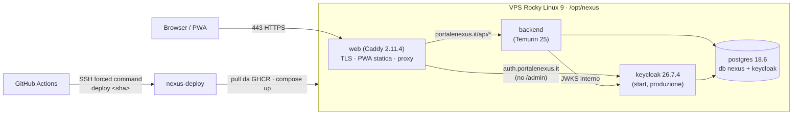

## Context

Server VPS IONOS: Rocky Linux 9 (immagine minimale), 4 GB di RAM, IP `217.160.116.172`. SSH solo con chiave (utente
`mauro`, gruppo `wheel`); firewalld e fail2ban attivi. Dominio `portalenexus.it` su DNS IONOS, con record A `@` già
presente e record email IONOS da mantenere (serviranno per l'invio dalle app). Versioni congelate: vedi
`openspec/changes/archive/2026-09-27-upgrade-latest-versions/design.md`. Requisiti: `specs/deployment`.

## Goals / Non-Goals

**Goals:** una demo online, sicura per impostazione, deployabile con un clic e riproducibile per commit.

**Non-Goals:** backup, email, monitoraggio, alta disponibilità (vedi proposal.md).

## Architettura sul server

Solo `web` pubblica porte (80, 443 TCP e 443 UDP per HTTP/3). Gli altri servizi stanno solo sulla rete interna di
Compose, così si evita il noto aggiramento di firewalld da parte delle porte pubblicate da Docker.

## Decisions

### D1 — Immagini costruite in CI, server solo esecutore
- **Build in CI.** GitHub Actions compila jar e PWA (come la CI attuale). I Dockerfile sono solo di runtime e copiano
  gli artefatti.
- **Tag.** Le immagini vanno su `ghcr.io/maubernardi/nexus-{backend,web}` con tag = SHA del commit (più `demo`).
- **Perché non compilare sul server.** Il server non compila nulla: Maven e Node richiederebbero RAM e strumenti che non
  devono stare in produzione.
- **Immagine web.** `nexus-web` = `caddy:2.11.4-alpine` + `dist/` + `Caddyfile`. Un solo container fa da TLS, file
  statici e reverse proxy, invece di due (nginx + proxy): meno memoria e meno parti mobili.
- **Configurazione del frontend.** La PWA è compilata con `VITE_AUTH_MODE=keycloak` e
  `VITE_KEYCLOAK_URL=https://auth.portalenexus.it`, cioè configurazione "cotta" nell'immagine. Va bene finché l'ambiente
  è uno; con più ambienti si passerà a un `config.json` letto a runtime.

### D2 — Caddy: HTTPS, routing, header
- **Siti.**
  - `portalenexus.it`: `/api/*` → backend; tutto il resto → PWA statica, con fallback su `index.html` per le route
    client. `sw.js` e `index.html` senza cache, gli asset con hash in cache immutabile.
  - `www.portalenexus.it` → redirect permanente al dominio principale.
  - `auth.portalenexus.it` → Keycloak. `/admin*` risponde 403.
- **Header** su tutti i siti:
  - `Strict-Transport-Security` (1 anno);
  - `X-Content-Type-Options: nosniff`, `Referrer-Policy: strict-origin-when-cross-origin`, `Permissions-Policy` minima;
  - CSP della PWA: `default-src 'self'; connect-src 'self' https://auth.portalenexus.it; frame-ancestors 'none'; …`.
- **Certificati.** Let's Encrypt automatico (HTTP-01 sulla porta 80); certificati nel volume `caddy-data`.

### D3 — Keycloak in produzione
- **Avvio.** `start` (non `start-dev`) con:
  - `KC_HOSTNAME=https://auth.portalenexus.it`, `KC_PROXY_HEADERS=xforwarded`, `KC_HTTP_ENABLED=true` (il TLS termina su
    Caddy, rete interna);
  - database `keycloak` sullo stesso PostgreSQL;
  - heap limitato (`-Xmx512m`), health abilitato.
- **Realm demo** (`infra/deploy/keycloak/nexus-realm.demo.json`), importato al primo avvio (`--import-realm` non
  sovrascrive un realm esistente):
  - stessi ruoli e stessi ID utente del realm di sviluppo, quindi coerente con il seed;
  - client `nexus-frontend` limitato a `https://portalenexus.it/*`;
  - `bruteForceProtected`, policy password;
  - password utenti come placeholder `${NEXUS_DEMO_PASSWORD_…}` risolti dalle variabili d'ambiente.
- **Console di amministrazione.** Non esposta (D2). Per usarla: tunnel SSH
  `ssh -L 8081:127.0.0.1:8081 nexus`, con Keycloak che espone la porta di management/HTTP solo su `127.0.0.1` del server.

### D4 — Database: due utenti e due database
- **Script di inizializzazione** (primo avvio del volume) in `infra/deploy/postgres/init/`. Crea:
  - `nexus_owner`, proprietario dello schema `nexus`, usato solo da Flyway;
  - `nexus_app`, con solo DML: default privileges `SELECT, INSERT, UPDATE, DELETE` sulle tabelle e `USAGE, SELECT` sulle
    sequenze create da `nexus_owner`;
  - `keycloak` con il proprio database.
- **Schema creato nell'init**, così l'utente applicativo ha `USAGE` fin da subito. Flyway trova lo schema già esistente.
- **Backend.** `spring.flyway.user/password` separati da `spring.datasource.*`, tramite `FLYWAY_USERNAME/PASSWORD`. In
  sviluppo e test valgono per default le stesse credenziali del datasource: nessun cambiamento.
- **Effetto.** `nexus_app` non può eliminare il trigger dell'audit trail (non è proprietario) né fare `TRUNCATE`:
  questo chiude il limite noto D6 della change del modello dati.

### D5 — Backend dietro proxy
- **Profili.** `PROFILES_ACTIVE=keycloak,seed` (demo).
- **Header del proxy.** `server.forward-headers-strategy=framework`.
- **Endpoint tecnici chiusi.** `OPENAPI_ENABLED=false`; actuator raggiungibile solo sulla rete interna, perché Caddy
  inoltra solo `/api/*`.
- **Validazione JWT.** `issuer-uri` = `https://auth.portalenexus.it/realms/nexus` (validazione del claim `iss`). Chiavi
  lette dalla rete interna con `jwk-set-uri=http://keycloak:8080/realms/nexus/protocol/openid-connect/certs`, senza
  "giro" su Internet.
- **Memoria.** Container limitato a 768 MB, `-XX:MaxRAMPercentage=75`.

### D6 — Deploy con chiave limitata (forced command)
- **Utente `deploy`** (senza password né shell interattiva utile) nel gruppo `docker`.
- **Chiave limitata.** La sua unica chiave in `authorized_keys` è
  `restrict,command="/usr/local/bin/nexus-deploy" ssh-ed25519 …`: qualunque comando si chieda, parte solo `nexus-deploy`.
- **Cosa fa `nexus-deploy`** (di proprietà di root, non modificabile da `deploy`):
  1. accetta solo `deploy <sha40>`;
  2. legge da stdin il token temporaneo di GitHub per il pull da GHCR (niente token nella riga di comando o nel
     process list);
  3. scarica i file di `infra/deploy/` di **quel** commit dal repository pubblico;
  4. `docker compose pull && up -d`;
  5. attende gli healthcheck, fa logout da GHCR ed elimina le immagini vecchie.
- **Effetto.** Chi rubasse la chiave potrebbe solo ridistribuire codice già pubblicato su GitHub.
- **Il workflow** `deploy-demo.yml` (`workflow_dispatch`, input `ref`, default `main`):
  1. build e push delle immagini;
  2. SSH con `known_hosts` fissato;
  3. smoke test esterno su `https://portalenexus.it` e sulla discovery OIDC.
- **Action.** Solo `actions/checkout`, `setup-java`, `setup-node` e `pnpm/action-setup` già in uso, fissate per SHA.
  Build e push con la CLI `docker` del runner, senza action di terze parti.

### D7 — Segreti e preparazione del server
- **`bootstrap.sh`**, eseguito una volta da `mauro` con sudo, idempotente:
  1. Docker CE 29.8.1 e Compose 5.5.1 dal repository ufficiale, a versione esatta;
  2. `daemon.json` con rotazione dei log;
  3. utente `deploy`, directory `/opt/nexus` e script `nexus-deploy`;
  4. `.env` (permessi 600, proprietario `deploy`) con password casuali generate da `openssl rand`, create solo se assenti;
  5. stampa **una volta** le password degli utenti demo;
  6. firewalld: `http`, `https`, `443/udp`.
- **SELinux** resta `enforcing`: i bind mount usano l'etichetta `:Z`.
- **Chiave di deploy.** La coppia di chiavi è generata in locale. La privata va come segreto dell'environment GitHub
  `demo` e viene subito eliminata dal disco locale; la pubblica passa a `bootstrap.sh`. Anche il `known_hosts` del server
  è un segreto, con l'impronta verificata dal committente dal server stesso.

### D8 — DNS
Da aggiungere su IONOS:
- `A auth → 217.160.116.172`;
- `A www → 217.160.116.172`;
- `CAA @ 0 issue "letsencrypt.org"`.

I record email restano invariati. Nessun AAAA finché IPv6 non è configurato e verificato.

## Risks / Trade-offs

- [`deploy` nel gruppo `docker` equivale a root] → chiave con forced command (D6), script non modificabile, codice
  solo dal repository.
- [Downtime di qualche secondo durante `compose up`] → accettabile per una demo; blue/green in futuro se servisse.
- [Certificati Let's Encrypt bloccati se il DNS non è pronto] → verifica dei record prima del primo deploy;
  Caddy ritenta da solo.
- [Configurazione del frontend nell'immagine] → un solo ambiente per ora (D1).
- [Nessun backup] → dati solo fittizi; i backup sono un prerequisito del passaggio in produzione.
- [Placeholder del realm] → da verificare in locale con Keycloak 26.7.4 prima del deploy (task dedicato).
