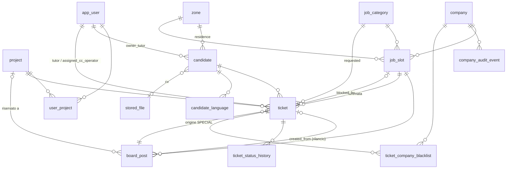

## Context

Motivazione: vedi proposal.md. Le decisioni sono state prese con il committente in 8 step (perimetro, convenzioni,
utenti, GDPR, Ticket, Company/JobSlot, bacheca, seed). Stack congelato: PostgreSQL 18.6, Spring Boot 4.1.1 / Hibernate 7.4,
Flyway (schema `nexus`). Esiste già la migrazione `V1__init.sql`.

## Goals / Non-Goals

**Goals:** modello completo con integrità garantita dal database (chiavi esterne, unicità, `CHECK`, trigger) oltre che
dal codice; entità e repository pronti per la macchina a stati; seed utile allo sviluppo.

**Non-Goals:** logica delle transizioni, API di dominio, visibilità per ruolo (vedi proposal.md, Non-goals).

## Modello

| Tabella | Colonne principali (oltre a `id`, audit e `version` dove indicato) | Vincoli chiave |
|---|---|---|
| `project` | `code`, `name`, `active` | `code` unico |
| `app_user` | `external_id`, `username`, `first_name`, `last_name`, `email`, `phone`, `role`, `active` | `external_id`, `username`, `email` unici; `role` ∈ {TUTOR, CALL_CENTER, ADMIN} |
| `user_project` | `user_id`, `project_id` | PK composta |
| `zone`, `job_category` | `code`, `name`, `active` | `code` unico |
| `stored_file` | `original_name`, `content_type`, `size_bytes`, `checksum_sha256`, `storage_key` | `storage_key` unico; `size_bytes >= 0` |
| `candidate` | `owner_tutor_id`, `first_name`, `last_name` (svuotabili solo se anonimizzato), `birth_year`, `gender`, `nationality`, `citizenship`, `residence_zone_id`, `has_driving_license`, `license_types` (`varchar[]`), `has_vehicle`, `transport_mode`, `has_law68`, `education_level`, `constraints`, `cv_file_id`, `anonymized_at` | enum via `CHECK`; ISO a 2 lettere maiuscole; patente ⇔ `cardinality(license_types) > 0`; tipi ⊆ elenco ammesso; `birth_year` tra 1900 e 2100 ("non nel futuro" lo verifica l'applicazione: un `CHECK` non può usare `current_date` in modo affidabile) |
| `candidate_language` | `candidate_id`, `language` (ISO 639-1), `level` | (`candidate_id`, `language`) unico; `level` ∈ {A1…C2, MADRELINGUA} |
| `company` | `name`, `vat_code`, `legal_address`, `contact_person`, `phone`, `email`, `active` | `vat_code` unico, 11 cifre |
| `job_slot` | `company_id`, `job_category_id`, `zone_id`, `title`, `description`, `status`, `blocked_by_ticket_id`, **`version`** | `status = 'BLOCCATA'` ⇔ `blocked_by_ticket_id IS NOT NULL`; `blocked_by_ticket_id` unico |
| `ticket` | `number`, `tutor_id`, `project_id`, `candidate_id`, `type`, `status`, `is_fast_track`, `requested_job_category_id`, `requested_job_free_text`, `board_post_id`, `assigned_cc_operator_id`, `job_slot_id`, `timer_started_at`, `timer_reminder_sent_at`, `timer_deadline_at`, **`version`** | `number` unico (sequenza); esattamente una tra categoria e testo libero; `type = 'SPECIAL'` ⇒ `board_post_id` presente; `is_fast_track` ⇒ `SPECIAL`; avvio ⇔ scadenza |
| `ticket_status_history` | `ticket_id`, `from_status`, `to_status`, `note` (istante e autore = `created_at`/`created_by`) | stati ammessi |
| `ticket_company_blacklist` | `ticket_id`, `company_id`, `reason`, `created_at`, `created_by` | PK composta |
| `board_post` | `number`, `job_slot_id`, `title`, `project_id`, `status`, `age_min`, `age_max`, `weekly_hours`, `duration_months`, `notes`, `published_at`, `made_public_at`, `created_from_ticket_id`, **`version`** | `number` unico (sequenza); indice unico parziale su `job_slot_id` per `DRAFT`/`PUBLISHED`; `PUBLISHED` ⇒ `published_at`; `made_public_at` ⇒ `project_id` nullo; età 14–99 con `age_min <= age_max`; ore settimanali 1–60; durata 1–36 mesi |
| `company_audit_event` | `company_id`, `ticket_id`, `event_type`, `details` (`jsonb` oggetto), `created_at`/`created_by` (istante e autore; nessuna colonna di modifica) | append-only (D6) |

## Decisions

### D1 — Identificativi: TSID con generatore nostro
- **Chiave primaria.** È un `BIGINT` TSID, generato dall'applicazione con `io.hypersistence:hypersistence-tsid` **2.1.4**
  tramite un'annotazione `@TsidId` (un `BeforeExecutionGenerator` di Hibernate 7, poche righe).
- **Libreria esclusa.** `hypersistence-utils` non ha ancora un modulo per Hibernate 7.4 e accoppierebbe la versione di Hibernate.
- **Rappresentazione esterna.** Nei DTO l'ID sarà `String`, in Crockford base32 a 13 caratteri: JavaScript non gestisce gli interi a 64 bit.
- **Numeri leggibili.** `ticket_number_seq` e `board_post_number_seq`, con `DEFAULT nextval(...)` e colonne
  `@Generated` in lettura. Possono esserci buchi di numerazione, accettati: non sono numeri di protocollo.
- *Alternative considerate:* UUID v7 (troppo lungo per il committente), `BIGINT` come chiave (enumerabile), Sqids (solo offuscamento).

### D2 — Audit e concorrenza
- **Colonne di audit.** Spring Data JPA Auditing: `@CreatedDate`, `@LastModifiedDate`, `@CreatedBy`, `@LastModifiedBy`
  in una `@MappedSuperclass` `AbstractAuditingEntity`. Le date sono `timestamptz`, mappate su `Instant`.
- **Autore.** L'`AuditorAware` restituisce lo username dell'utente autenticato, oppure `system` per i job. È un `varchar`
  senza chiave esterna, per non legare l'audit al ciclo di vita degli utenti.
- **Blocco ottimistico.** `@Version` su Ticket, JobSlot e BoardPost. La traduzione del conflitto in HTTP 409 arriverà con le API.

### D3 — Enum ed elenchi ammessi
- **Enum.** Enum Java con `@Enumerated(STRING)` e `CHECK (col IN (...))` nel database, con i valori del brief (italiani per gli stati).
- **Elenchi di valori.**
  - `gender`: `M`, `F`, `ALTRO`, `NON_DICHIARATO`;
  - `transport_mode`: `AUTO_PROPRIA`, `MEZZI_PUBBLICI`, `BICICLETTA`, `A_PIEDI`, `ALTRO`;
  - `education_level`: `NESSUN_TITOLO`, `LICENZA_ELEMENTARE`, `LICENZA_MEDIA`, `QUALIFICA_PROFESSIONALE`, `DIPLOMA`, `ITS`,
    `LAUREA_TRIENNALE`, `LAUREA_MAGISTRALE`, `DOTTORATO` (allineati ai livelli EQF);
  - patenti: `AM`, `A1`, `A2`, `A`, `B`, `BE`, `C1`, `C1E`, `C`, `CE`, `D1`, `D1E`, `D`, `DE`, `CQC`, `KB`.
- **Patenti nel database.** `license_types` è `varchar[]`, mappato con il supporto nativo agli array di Hibernate 7.
  Il vincolo `license_types <@ ARRAY[...]` impedisce valori estranei.

### D4 — Relazioni cicliche
`ticket` ↔ `job_slot` ↔ `board_post` si riferiscono a vicenda (abbinamento, blocco, origine, rilancio). Le tabelle si
creano prima e le chiavi esterne si aggiungono con `ALTER TABLE` a fine migrazione. Lato JPA le relazioni sono `LAZY`,
con `@ManyToOne` o `@OneToOne` dal lato che possiede la colonna. Non ci sono cascade tra aggregati diversi. L'unica
cascade è `candidate` → `candidate_language` (orphan removal).

### D5 — Dati ricavati invece che duplicati
Azienda e zona della proposta sul ticket, azienda e zona del post: si leggono da `job_slot`. Rispetto al brief spariscono
`ticket.company_id`, `board_post.company_id` e `board_post.zone`. Il titolo del post resta autonomo, perché è il testo
dell'annuncio. La blacklist e il blocco invece riferiscono direttamente azienda o ticket, perché hanno una semantica propria.

### D6 — Audit trail immodificabile
- **Trigger.** `company_audit_event` ha trigger `BEFORE UPDATE OR DELETE` (per riga) e `BEFORE TRUNCATE` (per istruzione)
  che sollevano un'eccezione.
- **Entità JPA.** L'entità è `@Immutable`, e il repository espone solo inserimento e lettura (niente `JpaRepository` completo:
  un'interfaccia `Repository` con i metodi ammessi).
- **Limite noto.** Il proprietario dello schema può rimuovere il trigger. In produzione andranno separati l'utente
  Flyway (proprietario) e l'utente applicativo (solo DML, senza DDL): nota per la change di deploy.

### D7 — Accesso riservato agli utenti censiti
- **Filtro.** Dopo l'autenticazione (JWT o mock) un filtro cerca `app_user` per `external_id` (indice unico):
  - utente assente o `active = false` → 403 dall'handler già esistente;
  - ruolo diverso da quello del token → aggiorna la copia e lo registra nel log (senza dati personali).
- **Costo.** Una query indicizzata per richiesta, accettabile. Se servisse, una cache breve (Caffeine) si aggiunge senza cambiare il contratto.
- **Stesso `external_id` in entrambe le modalità.**
  - Nel realm Keycloak di sviluppo gli utenti hanno `id` fissi, e il `sub` coincide.
  - Gli utenti mock (`application-security-mock.yml`) acquisiscono un campo `id` con lo stesso valore; l'header `X-USER-ID`
    resta lo username. Il principal usa `id` come identificativo.
- **Test d'integrazione.** Inseriscono gli utenti necessari, perché il profilo `test` non carica il seed.

### D8 — Seed solo in locale
- **Script ripetibili.** Script Flyway ripetibili `R__seed_*.sql` in `classpath:db/seed`, idempotenti
  (`INSERT ... ON CONFLICT DO NOTHING`). Si rieseguono solo se cambia il loro contenuto.
- **Perché non versionati.** Un `V1000__seed` bloccherebbe le future migrazioni `V3`, `V4`… con errore "out of order".
- **Profilo.** Nuovo sotto-profilo `seed` nel gruppo `local`: `application-seed.yml` aggiunge `classpath:db/seed` a
  `spring.flyway.locations`. Profili `test` e `keycloak` esclusi.
- **ID.** I TSID del seed sono costanti precalcolate con la libreria.

### D9 — GDPR del candidato
La protezione è affidata al controllo degli accessi, per scelta del committente: nessuna cifratura applicativa. Misure di contorno:
- nessun dato personale nei log (nome, cognome, vincoli, recapiti): i `toString()` delle entità li escludono;
- in produzione, utente database con privilegi minimi (vedi D6) e backup cifrati;
- `anonymized_at` predispone il futuro job di anonimizzazione, che svuoterà i campi identificativi e sanitari e terrà quelli statistici.

## Risks / Trade-offs

- [Dati di categoria particolare in chiaro nel database] → controllo degli accessi e misure D9. Scelta documentata: se il
  DPO richiederà la cifratura servirà una migrazione dei dati.
- [Buchi nella numerazione progressiva] → accettati (D1). Se servisse un protocollo senza salti, andrebbe progettato a parte.
- [Query `app_user` a ogni richiesta] → indice unico; cache aggiungibile senza impatti (D7).
- [Il seed contiene ticket in stati arbitrari, prima che esista la macchina a stati] → sono dati dimostrativi, coerenti con
  i vincoli del database. La change della macchina a stati li riallineerà se serve.
- [Trigger aggirabile dal proprietario dello schema] → separazione degli utenti database in produzione (D6).

## Open Questions

- Durata di conservazione dei dati del candidato: la definirà la cooperativa o il DPO. Non cambia il modello.
- Elenco reale di zone e tipologie di mansione: il seed usa segnaposto.
